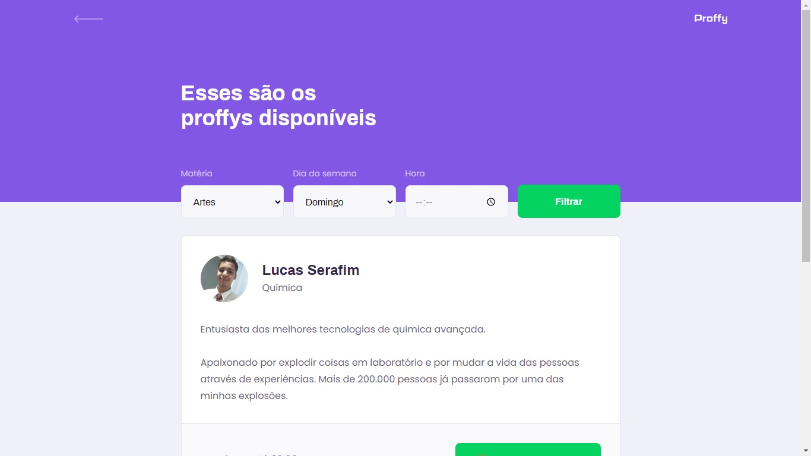

   

## :notebook:  Índice
- [Sobre o Proffy](#newspaper-sobre-o-proffy)
- [Design das paginas](#art-design-das-p%C3%A1ginas)
- [Tecnologias utilizadas](#computer-tecnologias-utilizadas)
- [Clonar esse projeto](#vhs--clonar-esse-projeto)
- [Licença](#scroll-licen%C3%A7a)

## :newspaper: Sobre o Proffy
O projeto está sendo realizado na semana NLW segunda edição (Next Level Week). 
O mesmo consiste em um site de alunos e professores, onde um aluno pode procurar um tutor de determinada matéria e agendar um horário. 
As pessoas interessadas em ensinar poderam se cadastar e incluir a matéria que deseja ensinar, horário disponível e custo pela aula ou por hora.

## :art: Design das páginas
<h3 align="center">
Desktop Screenshot
</h3>

|  |  |
| --- | --- |

## :computer: Tecnologias utilizadas
- HTML5
- CSS3
- JavaScript
- Node.js

## :vhs:  Clonar esse projeto
Utilize o comando `` git clone https://github.com/LeonEvil/next-level-week-2.git `` em seu terminal git. 
Com seu prompt de comando (git) aberto na pasta do projeto, execute esse comando: ``npm run dev`` 
Após isso vá até seu navegador e digite ``localhost:5050`` ou se preferir ``ip-da-sua-maquina:5050``

## :scroll: Licença
Todos arquivos estão sob [Licença MIT.](https://github.com/LeonEvil/next-level-week-2/blob/master/LICENSE)

Criado por [Lucas Serafim.](https://github.com/LeonEvil/)
